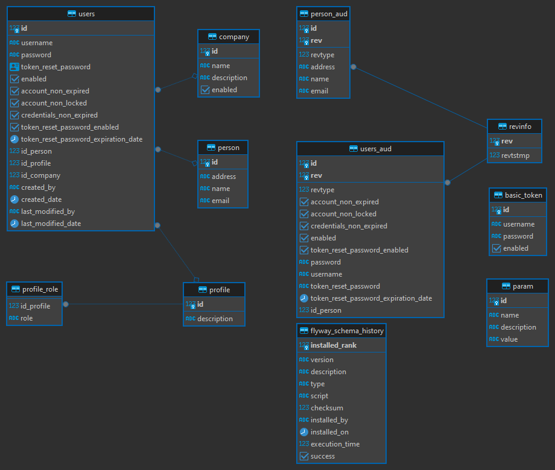

# Authenticator Project

[](https://circleci.com/gh/Suleiman-Moraes/authenticator)

      

This project is a Java Authenticator built with Spring Boot. It provides authentication functionalities using modern and production-ready tools.

---

## Table of Contents

* [Description](#description)
* [Prerequisites](#prerequisites)
* [Dependencies](#dependencies)
* [Usage](#usage)
* [Building the Project](#building-the-project)
* [Using Docker](#using-docker)
* [Database Model](#database-model)
* [VSCode Config Suggestions](#vscode-config-suggestions)
* [Contributing](#contributing)
* [License](#license)
* [Connect with Me](#connect-with-me)

---

## Description

The Authenticator project is developed in Java 21 using the Spring Boot framework. It provides a robust authentication system with features such as:

* Spring Security
* JWT Token Authentication
* Spring Data JPA with Flyway
* HATEOAS support
* Model mapping via ModelMapper and MapStruct
* API documentation with Springdoc OpenAPI

---

## Prerequisites

Ensure you have the following installed:

* Java 21
* Maven 3.x
* Docker & Docker Compose (optional for containerized execution)

---

## Dependencies

Main libraries used:

* **Spring Boot Starter Actuator**
* **Spring Boot Starter Data JPA**
* **Spring Boot Starter HATEOAS**
* **Spring Boot Starter Security**
* **Spring Boot Starter Validation**
* **Spring Boot Starter Web**
* **Flyway Core + Flyway PostgreSQL**
* **Commons Lang 3**
* **ModelMapper**
* **MapStruct**
* **Java JWT (Auth0)**
* **Hibernate Envers**
* **Springdoc OpenAPI Starter WebMVC UI**
* **H2 Database** (development)
* **PostgreSQL Driver**
* **Lombok & Lombok MapStruct Binding**

### Testing

* **Spring Boot Starter Test**
* **Spring Security Test**
* **Rest Assured**
* **Testcontainers PostgreSQL**

---

## Usage

To run this project locally:

```bash
# Clone the repository
git clone https://github.com/Suleiman-Moraes/authenticator.git
cd authenticator

# Build the project
mvn clean install

# Run the application
java -jar target/authenticator-1.0.0.jar
```

The application will start by default on [http://localhost:8080](http://localhost:8080).

---

## Building the Project

Build using Maven:

```bash
mvn clean install
```

---

## Using Docker

You can run this project with Docker Compose:

```bash
mvn clean install
docker-compose -f docker-compose-full.yaml up -d
```

---

## Database Model



---

## VSCode Config Suggestions

### settings.json

```json
{
  "java.configuration.updateBuildConfiguration": "interactive",
  "files.exclude": {
    "**/.git": true,
    "**/.svn": true,
    "**/.hg": true,
    "**/CVS": true,
    "**/.DS_Store": true,
    "**/target": true,
    "**mvn**": true
  },
  "java.compile.nullAnalysis.mode": "automatic",
  "spring-boot.ls.java.home": "{path}\\jdk-21",
  "java.jdt.ls.java.home": "{path}\\jdk-21",
  "actionButtons": {
    "commands": [
      {
        "name": "MVN_TEST",
        "color": "yellow",
        "command": "mvn -o test"
      },
      {
        "name": "JACOCO",
        "color": "yellow",
        "command": "mvn jacoco:report"
      }
    ]
  }
}
```

### launch.json

```json
{
  "version": "0.2.0",
  "configurations": [
    {
      "type": "java",
      "name": "authenticator",
      "request": "launch",
      "cwd": "${workspaceFolder}",
      "console": "internalConsole",
      "mainClass": "com.moraes.authenticator.AuthenticatorApplication",
      "projectName": "authenticator",
      "env": {
        "server.port": 8080,
        "spring.profiles.active": "postgre"
      }
    }
  ]
}
```

---

## Contributing

Contributions are welcome! Please follow the [Contribution Guidelines](CONTRIBUTING.md).

---

## License

This project is licensed under the [MIT License](LICENSE).

---

## Connect with Me

* LinkedIn: [Suleiman Moraes](https://www.linkedin.com/in/suleiman-moraes/)

---